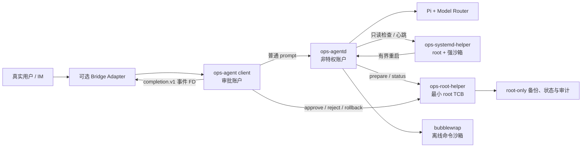

<div align="center">

# Pi Ops Agent

**一个基于 Pi、面向 Linux 的最小权限、可审计、可恢复运维 Agent。**

[](https://github.com/KiritoKing/pi-ops-agent/actions/workflows/ci.yml)


[架构](#架构设计) · [代码组织](#代码组织) · [快速开始](#快速开始) · [设计文档](#设计文档)

</div>

Pi Ops Agent 将自然语言运维能力放在一个由独立账户、操作系统沙箱、类型化 root 协议和人工审批共同组成的控制面之后。它可以常驻服务器，完成健康巡检、故障诊断和软件安装等工作，但模型本身始终不是权限边界。

当前版本使用 Pi 作为 agent harness，默认将任务路由到 `deepseek/deepseek-v4-flash`，支持可选的 BotMux 适配器；核心进程不依赖 BotMux、飞书或任何具体 IM 实现。

## 核心亮点：安全可控的运维环境

这个项目最重要的设计不是“让 Agent 能执行 shell”，而是让每次高权限操作都可约束、可解释、可追踪、可恢复：

- Agent 永久运行在非特权 `ops-agent` 账户中；通用 Bash 位于无网络的 bubblewrap 沙箱内，宿主仅有 workspace 可写。
- root 权限收敛在两个小型 Go helper 中；普通变更只能使用版本化、类型化 RPC，不存在任意 root shell 接口。
- 高权限变更遵循 `准备 → 人工批准 → 执行 → 验证 → 提交/回滚` 状态机，审批绑定不可变的 `changeId` 与计划摘要。
- 变更前创建 root-only 备份，三个进程分别写入防篡改哈希链审计；失败时自动回滚，无法安全恢复时进入 `RECOVERY_REQUIRED`。
- systemd 负责进程级拉起，独立 watchdog 负责语义心跳和有界重启，避免 Agent 卡死后无人接管。

> [!IMPORTANT]
> Prompt、模型输出和黑名单都不是安全边界。完整威胁模型、信任边界、Bash 取舍和已知限制见[安全模型](docs/security-model.md)。

## 架构设计



| 组件 | 身份与职责 | 设计原因 |
|---|---|---|
| `ops-agentd` | 非特权账户；承载 Pi 会话、模型路由、工具编排和 Agent 审计 | Prompt、模型输出和日志都不可信，因此攻击面最大的部分不能拥有 root |
| `ops-root-helper` | root；准备、备份、批准后执行、验证与回滚类型化变更 | 把可信计算基缩小为明确的协议和有限执行器 |
| `ops-systemd-helper` | root + 强 systemd 沙箱；只读巡检、心跳与固定 unit 的有界重启 | 即使 Agent 会话卡死，健康检查与恢复能力仍独立可用 |
| `ops-agent` client | 审批账户；转发 prompt，并在本地截获 `/approve` 等命令 | 审批不进入模型上下文，并由内核 `SO_PEERCRED` 校验真实 UID |
| Bridge adapter | 可选、独立身份；把任意 IM 接入版本化完成事件 | 核心不持有 IM 凭据，也不耦合 BotMux、飞书或其他厂商 SDK |

### 为什么同时使用 TypeScript 和 Go

TypeScript 用于 Pi SDK 所在的模型、会话和交互层，便于复用其原生类型和流式事件；Go 用于 root-helper 与 systemd-helper，因为它可以生成独立静态二进制，并直接、清晰地处理 Unix socket、peer credential、文件权限和进程边界。两者之间只通过版本化 JSON RPC 通信，使高迭代的 Agent 层与小而稳定的特权控制面彼此隔离。

详细控制流、socket 和运行时目录见[架构文档](docs/architecture.md)。

## 代码组织

```text
pi-ops-agent/
├── src/
│   ├── agentd/             # Pi 会话、模型路由、工具、沙箱与 Agent 审计
│   ├── client/             # 人机交互、审批命令拦截与完成事件发布
│   └── shared/             # TS 侧配置、协议、校验、脱敏与 RPC 基础设施
├── cmd/                    # 两个 Go helper 的薄入口
├── internal/               # Go 侧协议、peer credential、RPC 与特权执行器
├── integrations/           # 实现无关的外部 bridge 适配层；当前包含 BotMux
├── config/                 # Agent、模型、运行时和 bridge 配置示例
├── systemd/                # services、target、timer 与 tmpfiles 定义
├── scripts/                # 安装、凭据加密、健康检查和卸载脚本
├── docs/                   # 架构、安全、部署和运维细节
└── test/                   # TypeScript 单元测试；Go 测试与源码同目录
```

`cmd/` 只负责解析启动参数并装配依赖，特权逻辑放在不可被外部包导入的 `internal/`；`src/` 只包含与 IM 无关的核心能力；任何消息平台接入都应新增到 `integrations/<bridge>/`，消费统一的 `completion.v1` NDJSON 事件，而不是修改 Agent 核心。

## 操作与模型路由

| 路由 | 典型任务 | Thinking | 权限结果 |
|---|---|---|---|
| R0 | 状态、健康、磁盘、负载、版本 | `low` | 只读 |
| R1 | 日志分析、故障诊断、一般运维问题 | `medium` / `high` | 只读；写操作仍须转入 R2 |
| R2 | 安装、更新、配置、重启、删除、回滚 | `high` | 只能准备变更，等待真实用户批准 |

例如，用户可以先要求“准备安装 jq，但不要执行”。Agent 返回计划与 `changeId` 后，审批账户需要另发：

```text
/status <changeId>
/approve <changeId>
```

`/approve`、`/reject`、`/rollback` 和 `/status` 由 client 本地解析，不会进入模型上下文。只有 root-helper 返回 `COMMITTED`，系统才会向用户宣告成功。

## 快速开始

### 前置条件

- Linux + systemd + bubblewrap
- Node.js 22.19 或更高版本
- Go 1.23 或更高版本
- npm、Git，以及一个真实的非 root 审批账户

### 构建与检查

应直接在目标 Linux 架构上构建 Go helper：

```bash
git clone https://github.com/KiritoKing/pi-ops-agent.git
cd pi-ops-agent
npm ci
npm run check
npm run build
mkdir -p bin
go build -trimpath -o bin/ops-root-helper ./cmd/ops-root-helper
go build -trimpath -o bin/ops-systemd-helper ./cmd/ops-systemd-helper
```

### 安装

```bash
sudo ./scripts/install.sh --approver-user "$USER"
sudo /opt/pi-ops-agent/scripts/encrypt-credential.sh
sudo systemctl start ops-agent.target
sudo systemctl start ops-agent-healthcheck.timer
sudo /opt/pi-ops-agent/scripts/healthcheck.sh
```

安装器会复制当前 Node runtime，创建独立账户和运行目录，并安装经过加固的 systemd units。加组后需要重新登录，或重启使用审批账户运行的 bridge service。

### 只读冒烟

```bash
/opt/pi-ops-agent/bin/ops-agent --session-id local-smoke-001
```

输入：

```text
只读检查这台机器的负载、磁盘和失败的 systemd units，不要修改任何东西
```

完整安装、systemd credential、BotMux 示例与验收清单见[部署指南](docs/deployment.md)。

> [!WARNING]
> 当前仅支持 Linux/systemd。Pi 0.83.0 的上游依赖仍有已知审计告警；面向生产或高价值主机部署前，请先阅读[安全模型中的上游依赖告警](docs/security-model.md#pi-0830-上游依赖告警)，并在一次性测试机完成安装、回滚、崩溃恢复和 prompt injection 对抗测试。

## 设计文档

- [架构与进程边界](docs/architecture.md)：控制流、三进程拆分、双 daemon 与运行时目录。
- [安全模型](docs/security-model.md)：威胁模型、分层隔离、审批状态机、密钥与已知限制。
- [部署指南](docs/deployment.md)：Linux 安装、systemd credential、BotMux 接入与验收。
- [运维手册](docs/operations.md)：日常巡检、审计验证、恢复、升级和卸载。
