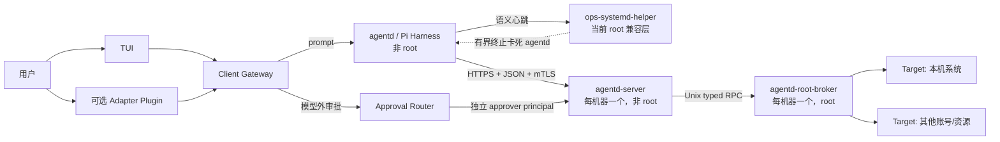

<div align="center">

# Pi Ops Agent

**一个原生运行于 Linux/systemd、面向多机器与多账号的最小权限运维 Agent。**

[](https://github.com/KiritoKing/pi-ops-agent/actions/workflows/ci.yml)


</div>

Pi Ops Agent 使用 Pi Agent Harness 提供自然语言诊断和受控变更能力。`agentd` 始终使用
非特权账户；模型 API 请求需要网络，而模型可调用的 `ops_bash` 仅在无网络 bubblewrap
可用时注册。跨机器访问经 mTLS `agentd-server`，root 能力只存在于目标机本地、
Unix-only 的类型化 `agentd-root-broker`，审批在模型上下文之外完成。

## MVP 能力

- 一个中央 `agentd` 管理多台 systemd Linux 机器。
- 目标态 `agentd-guard` 与 `agentd` 同 UID，只做语义心跳和有界保活；当前
  `ops-systemd-helper` 仍是 root 兼容层，能力只允许继续收缩。
- 每台机器一个非 root `agentd-server`，管理多个 Target/Unix 账号。
- 每台机器一个 root `agentd-root-broker`，只执行 root-owned policy 允许的类型化操作。
- 多 Session；一个 Session 首次访问时原子绑定一个 Machine + Target，同一机器可有多个
  Session，每个 Session 独占可写 scratch workspace。
- 有界主机、进程、service、journal 和文件巡检。
- 类型化 change、写前备份、不可变计划、人类审批、验证与版本化回滚证据。
- 摘要绑定的声明式 `managed-workload` 插件；通用 OCI 执行器固定 loopback、资源、mount 与 capability 安全模板，不暴露宿主 shell 或原始 Docker argv。
- TUI 是始终安装的本地入口；BotMux 等 IM 以独立 Adapter Plugin 后装。
- amd64/arm64 预构建 Release；目标机无需 Git、Node、npm、Go 或本地构建。

Ops Agent 自身不提供 Docker、OCI、Compose 或非 systemd 部署。MVP 也不提供通用容器
管理、任意远端 root shell、记忆/自进化、自动批准写操作、多人审批和 controller HA。

## 架构



`agentd-server` 的服务账户本身不需要拥有业务资源。`agentd-root-broker` 根据 root-owned policy
把 Target 映射到 UID/GID、路径、unit 和固定 recipe；“允许 root 操作”不等于 server
获得 root 或任意 shell。

规范组件名是 `agentd / agentd-guard / agentd-server / agentd-root-broker`。当前版本
仍保留 `ops-agentd`、`ops-systemd-helper`、`ops-agent-server`、`ops-root-helper` 等 artifact
名称；部署命令继续使用真实 unit 名称。完整职责和迁移边界见[架构](docs/architecture.md)。

安全边界详见[安全模型](docs/security-model.md)。

## 一条命令初始化

Pi Ops Agent 只提供原生 systemd 部署。PVE LXC 不需要 Docker：

```bash
curl -fsSL https://raw.githubusercontent.com/KiritoKing/pi-ops-agent/main/scripts/install.sh \
  | sudo sh -s -- init
```

GitHub Raw 脚本只做平台探测、Release 下载和完整性校验；版本化 Release 安装器创建账号、
配置、systemd unit、模型 credential，启动核心并执行冒烟。目标机不会构建源码。

`init` 不安装或初始化 BotMux。完成后重新登录并进入 TUI：

```bash
ops-agent tui
```

业务能力使用与 Adapter 相同的受信插件目录、严格 manifest、摘要校验和原子安装机制。
`managed-workload` 插件只声明受限 OCI 工作负载；不能携带 root 代码、宿主命令或原始
Docker 参数。模型只能准备精确绑定 `id/kind/version/publisher/digest` 的
`plugin.install` 与 `workload.deploy`，每一步仍需模型外 `/approve <changeRef>`。

仓库随 Release 提供 `workload.hermes` 作为首个验证用例，但核心协议、Target 和执行器均不
包含 Hermes 专用字段。安装、模型外 credential 配置和交互验收见
[Hermes 工作负载指南](docs/workloads/hermes.md)。

BotMux 本体是外部依赖，不由 `init` 或插件包暗中联网安装。先按
[BotMux 官方文档](https://deepcoldy.github.io/botmux/)安装 `botmux`，随后直接向 Agent 发送：

```text
帮我安装 BotMux adapter
```

Agent 会查询可信插件目录、说明权限和包摘要、准备类型化安装计划，并等待管理员
`/approve <changeRef>`；Agent 自己不能审批或执行任意安装脚本。提交完成后，在同一个
交互式 TUI 输入精确命令 `/botmux-setup`：client 在模型外调用 BotMux 官方 setup、把
首个 bot 固定到 ops-agent wrapper、关闭开放私聊与 CLI 免审批绕过，再重启 BotMux。
Lark secret 只进入 BotMux 的终端交互，不进入模型、Agent transcript 或 argv。

固定 Tag、`.deb`、GitHub artifact attestation、PVE LXC 和后续机器 `join` 见
[部署文档](docs/deployment.md)。

## 权限与变更

有效能力取以下交集：

```text
Harness 固定工具
∩ Principal/Session 权限
∩ 已知 capability schema
∩ agentd-server capability
∩ root-owned policy
```

模型不能传 endpoint、证书、UID、`runAs`、任意宿主路径或 root argv。所有写操作遵循：

```text
PREPARED -> APPROVED -> EXECUTING -> COMMITTED
     |                        |
     +-> REJECTED/EXPIRED     +-> ROLLED_BACK/RECOVERY_REQUIRED
```

审批绑定 agentd-server、machine、Target、change、plan hash、policy/capability revision、前置条件、
期限和 nonce。连接中断后只查询原 change，不能重放 mutation。

## 目录

```text
src/             TypeScript Harness、Session、Client Gateway 与共享协议
cmd/             Go 命令薄入口
internal/        agentd-server、agentd-root-broker、兼容 guard、策略、备份、审计与恢复
plugins/         IM Adapter 与声明式 managed-workload 插件
integrations/    Adapter runtime
systemd/         原生 systemd unit 与 tmpfiles
scripts/         Raw bootstrap、Release 安装、健康与卸载
packaging/       可复现原生 Release、Debian 与插件打包
docs/            架构、安全、部署和运维事实
```

## 开发验证

本地开发仍需仓库工具链，但它与目标机部署无关：

```bash
npm ci
npm run check
npm run build
go vet ./cmd/... ./internal/...
go test -race ./internal/...
git diff --check
```

Linux 发布前还需验证 systemd unit、bubblewrap、干净 systemd VM/LXC、enrollment、真实模型和
Adapter 端到端。不能通过关闭 sandbox、放宽 UID/路径策略或跳过审批制造通过结果。

## 文档

- [架构与领域模型](docs/architecture.md)
- [安全模型](docs/security-model.md)
- [原生部署与接入](docs/deployment.md)
- [升级、审计与恢复](docs/operations.md)
