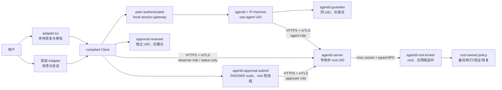

<div align="center">

# Pi Ops Agent

**面向 Linux/systemd 的最小权限运维 Agent：核心负责隔离和授权，Adapter 与 Workload 提供业务能力。**

[](https://github.com/KiritoKing/pi-ops-agent/actions/workflows/ci.yml)


</div>

Pi Ops Agent 的安全目标不是让 Agent “永远做不了高权限操作”，而是让它**不能自主、
免审批地做未授权操作**。普通 root 操作由版本化的类型协议表达；只有 root-owned Target policy
在 `authorization.standingScopes` 中逐项列出的普通 scope 才能复用持久授权，其余操作都在模型
上下文之外逐次审批。无法预先类型化的例外操作进入显式、计划绑定的 manual root capsule；
它可以在受管 host 产生任意 root 副作用，但永远只允许本地 TUI 经 PASSWD sudo 和真实
`/dev/tty` 人工审批，不能由 Agent、reviewer、standing policy 或外部 Adapter 自行授权，也不是
普通操作可复用的 raw-command RPC。

能力分成三层：

- **Core**：Pi Harness、非特权 sandbox、进程/账号隔离、HTTPS/mTLS C/S、类型化 root broker、
  审批与审计。Core 不内置 Agent 可见的业务工具。
- **Adapter**：决定外部会话、消息、发送动作和审批意图如何接入。TUI 是必须安装的恢复入口，
  BotMux 等外部系统由后装 Adapter 接入。
- **Workload**：提供 Agent 可见工具和受控运维 recipe。`workload.base` 提供基础诊断与 workspace
  命令；Hermes、BotMux 运维和 PVE 管理属于业务 Workload。

`adapter.tui` 与 `workload.base` 是启动所需的两个源码插件。安装器会先展示它们的源码摘要和
请求 scope，再要求用户明确同意；它们不是因“第一方”身份而自动可信。
真实 bubblewrap/user namespace 不可用时，初始化会失败并回滚，不会让必需的
`workload.base` 退化成宿主 shell 或进程内 loader。

## 架构概览



规范名称与当前 artifact 并非全部相同：

| 规范组件 | 当前 artifact | 当前状态 |
|---|---|---|
| `agentd` | `ops-agentd.service` | 已运行于 `ops-agent` 非 root 账号 |
| `agentd-guardian` | `agentd-guardian.service` | 同 UID 心跳与身份复核；旧 root `ops-systemd-helper` 已退出 release/runtime |
| local session gateway | `agentd-client-gateway.service` / `agentd-client-gateway` | `SO_PEERCRED` + exact Adapter digest Session namespace；公开 socket 与 owner-only agentd backend 分离 |
| approval reviewer | `agentd-approval-reviewer.service` | 独立 UID/Unix socket；确定性风险解释，不能签名或批准 |
| approval submitter | `agentd-approval-submit` | 无 daemon/socket；每次以 PASSWD sudo 启动 root 短进程，重新展示/确认权威计划后签名 |
| `agentd-server` | `ops-agent-server.service` / `ops-agent-server` | TLS 1.3 mTLS HTTPS 入口，专用非 root 账号 |
| `agentd-root-broker` | `ops-root-helper.service` / `ops-root-helper` | root-only Unix RPC、策略、变更状态和恢复证据 |
| PVE root broker | `ops-pve-root-helper.service` / `ops-root-helper --domain=pve` | `init` 要求本机 `/usr/bin/pvesh`；`join` 还要求 signed `--pve` enrollment 精确匹配；独立 socket/state/audit |

完整进程、身份和兼容边界见[架构文档](docs/architecture.md)。

## 当前实现范围

已经接入的关键边界：

- Pi 依赖升级到 `0.84.1`，以公开 `agent_settled` 作为一次 turn 的权威完成事件；
- Client 在 agentd socket 断开后立即停止读取 stdin 并退出，外部 PTY 可重建会话；
- 公开 `agentd.sock` 由 local session gateway 持有；同一可预测 Session ID 会按真实 peer UID、
  Adapter ID/digest 隔离，单个 namespace 同时只允许一个 live writer，agentd 只监听 `backend.sock 0600`；
- agent key 保持 `ops-agent:ops-agent 0600`；本地管理员与 Adapter 只经独立
  `ops-agent-client` group 访问 agent socket、Plugin CAS 和 status-only observer identity；
- `workload.base` 的持久化授权决定基础工具是否注册，未注册时 Agent 不会获得这些工具；
- Source Plugin 使用严格 manifest、canonical SHA-256、不可变快照、scope 绑定和原子 `current`；
  常规注册通过 broker 的 typed `plugin.register` 把 version、publisher、capabilities、digest 与
  requestedScopes 一并写入权威计划，执行前 re-hash 并逐项重验，失败时恢复先前 registration；
- Plugin 注册授权和 Target 授权相互独立：每次安装或源码更新都因新 digest 经过本地逐次审批，
  实际 root 能力再取 plugin grant、Target 资源 allowlist 与显式 standing scope 的交集；
- legacy policy 或缺少/留空 `authorization.standingScopes` 的 Target 仍逐次人工审批；当前只有
  精确的普通文件、service/workload service 与非 critical PVE operation scope 可 standing execute；
  其中通用 `file.write`/`service.action` 还必须由真实 `workload.base` caller 注入当前摘要，且
  Target 的 `authorization.baseWorkloadDigest` 必须与它完全一致，源码更新后不会继承旧授信；
  PVE stop/reboot、snapshot delete/rollback、restore、migrate 固定逐次人工审批，
  package/artifact 安装、`plugin.register`、`plugin.install`、`workload.deploy` 与
  `breakglass.script` 永不使用 standing 授权；
- 每次 `change.prepare` 后 controller 都必须再发起 `change.status` 并校验该 domain pinned
  Ed25519 broker key 的 receipt；只有签名状态为 `PENDING_APPROVAL` 时才向审批 side-channel
  暴露 change，签名状态为 `COMMITTED` 则表示命中了 standing policy；
- `/approve` 与 `/rollback` 先取得 broker 的权威计划，独立 reviewer 解释风险；第二次相同
  命令只会启动 root-owned submitter，它再次查询计划、要求本地密码和包含 plan hash 的精确
  TTY 确认后才签名执行；
- server 只转发 broker 结果；core/PVE broker 用隔离的 Ed25519 key 签署 status/action receipt，
  Client 与 submitter 按 server registration 固定的公钥验证完整 scope 和结果摘要；
- ApprovalGrant 同时绑定 server、machine、Target、change、plan、policy revision、capability
  revision、期限和 nonce；
- PVE 已建模为固定 node/VM/LXC/snapshot/backup/restore/migration 类型，不接收通用
  `pvesh`、`qm` 或 `pct` 参数。
- `workload.hermes-ops` 与 `workload.botmux-ops` 把固定 unit/path schema 留在 digest-covered
  source 中，通过通用 `target.inspect` / `workload.command.inspect` / `workload.service.manage`
  providers 工作；fixed command provider 只接收 semantic profileKey，由 root policy 固定
  root-owned executable/argv 并在 non-root network-isolated transient service 中运行，结果有 core
  broker receipt 且 audit 不存正文；service provider 以
  `workload.service.action` 准备 actual caller digest/account/manager/unit/action 全绑定的
  `reload`/`reset-failed`/`restart`/`start`/`stop`；root policy、权威前置状态和执行后验证仍由
  broker 负责，任意 CLI/argv 和配置正文不开放，`reload`/`reset-failed` 永不 standing；
- `adapter.tui` 的不可执行 `profile.json` 经固定 runner 校验后只启动 compiled Client；
  `adapter.botmux` 则从不可变 snapshot 执行真实 Source entrypoint，运行于专用
  `ops-agent-botmux` UID；两者每次都重验 active digest，并以真实 UID 通过独立非 root lease
  broker 的固定 socket 持有 exact digest，不能直接打开 registry lock；

仍在迁移中的边界必须按现状理解：

- Adapter 已有固定、非特权 Source runner：任意获批 `.mjs` Adapter 必须通过 strict descriptor，
  且除精确 `adapter.tui` profile 外都被强制为 status-only；Workload 源码在隔离 bubblewrap host
  中运行，tool capability 必须与 manifest 精确一致，provider 则只按 name + requested scope
  policy 授权；两者同名不会产生额外 authority；
- 旧 `.opspkg` catalog、`plugin.install`、`workload.deploy` 和 Hermes OCI executor 仍保留作
  兼容路径，尚未全部迁移成 Source Workload；
- 升级安装会停用并删除旧 `ops-systemd-helper` unit/drop-in，但保留历史 state/audit；
- 任意 root Target 都可以准备 manual root capsule，但它永远是逐次本地 TUI/PASSWD/TTY 审批；
  script 与 network 声明必须进入计划，backup paths 和 verify 可留空，但 reviewer 会把缺少恢复
  或验证证据标为 critical；PVE broker 不接受该 raw-script 例外，且 capsule 不提供自动回滚；
- reviewer 当前是只看用户原始输入与 broker 权威计划的确定性解释器；LLM/AST 拆分、基于
  reviewer 的低风险自动批准、多方审批、外部审计锚定和 controller HA 尚未实现。

更多准确状态见[重构基线](docs/mvp-refactor.md)。

## 初始化

仅支持 systemd Linux。Raw bootstrap 下载匹配架构的 Release、校验 checksum，并在可用时
通过 GitHub CLI 验证 attestation；主机修改由 Release 内的版本化安装器完成。

Ubuntu 24.04 且 `kernel.apparmor_restrict_unprivileged_userns=1`、AppArmor enabled 时，当前版本
不支持 controller/`init`；安装器会在任何持久主机修改前 fail closed。不要运行
`host-policy install` 尝试解锁，也不要关闭该 sysctl、启用 SUID bwrap、改成单层 sandbox、降低
`ProtectProc` 或使用 unconfined profile。真正支持这一组合需要独立、typed、短生命周期 spawn
supervisor。若旧版本已经留下 managed AppArmor files 或 loaded profiles，应保留为诊断证据，默认
卸载不会自动删除。只运行 server/core/PVE broker 的 `join` endpoint 不执行 Source Plugin，因此
不受这项 controller 限制，也不会管理 host policy。

生产环境应把 Raw URL 和 `OPS_AGENT_VERSION` 一起固定到同一 tag。Release installer 不调用
apt/dnf 等包管理器；任一 native command 缺失都会在主机变更前 fail closed。

```bash
curl -fsSL https://raw.githubusercontent.com/KiritoKing/pi-ops-agent/vX.Y.Z/scripts/install.sh \
  | sudo OPS_AGENT_VERSION=vX.Y.Z sh -s -- init
```

交互式初始化会分别显示 `adapter.tui` 与 `workload.base` 的 digest 和 scopes，并要求输入
精确确认。自动化环境必须先在变更系统中获得同等的人类授权，再显式传入：

```bash
curl -fsSL https://raw.githubusercontent.com/KiritoKing/pi-ops-agent/vX.Y.Z/scripts/install.sh \
  | sudo OPS_AGENT_VERSION=vX.Y.Z sh -s -- init --approve-required-plugins
```

这个参数不是让 Agent 自批；它表示调用方已经在外部流程中批准安装器刚展示且随 Release
固定的两个必要源码插件。任何其他 Adapter/Workload，以及这两个插件更新后的新 digest，
都必须重新审批。

完成后重新登录以刷新 supplementary groups，再运行：

```bash
ops-agent tui
```

生产部署应固定 Release tag；`join`、离线 enrollment、回退和 LXC 约束见
[部署文档](docs/deployment.md)。

## Plugin 入口

- [Source Plugin 信任、摘要、安装和更新](docs/plugins.md)
- [Adapter 会话、消息与审批边界](docs/adapters.md)
- [Workload 工具和类型化 recipe](docs/workloads.md)
- [Hermes 兼容工作负载](docs/workloads/hermes.md)
- [PVE 标准工作负载（typed ABI 已实现；真实 PVE lab 验收前为预览）](docs/workloads/pve.md)

仓库同时提供给其他代码 Agent 使用的开发 Skill：

- [`agentd-init`](skills/agentd-init/SKILL.md)：初始化、join、升级与恢复；
- [`agentd-adapter-dev`](skills/agentd-adapter-dev/SKILL.md)：Adapter API、威胁边界和示例；
- [`agentd-workload-dev`](skills/agentd-workload-dev/SKILL.md)：Workload API、typed broker recipe 和示例。

## 开发验证

```bash
npm ci
npm run check
npm run build
go vet ./cmd/... ./internal/...
go test -race ./internal/...
git diff --check
```

涉及 systemd、bubblewrap、安装器、真实模型、PVE 或 Adapter 的变更，还必须在隔离的
systemd Linux 上做对应冒烟、故障注入与恢复测试。没有完成的环境验证必须如实记录；不能
通过关闭 sandbox、放宽 UID/path/policy 或跳过审批制造通过结果。

## 文档

- [架构、进程与数据流](docs/architecture.md)
- [安全模型](docs/security-model.md)
- [部署与接入](docs/deployment.md)
- [升级、审计与恢复](docs/operations.md)
- [v0.3 重构基线与上游同步](docs/mvp-refactor.md)
