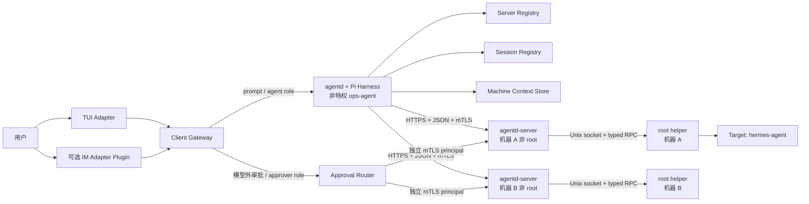

# MVP 重构架构

## 领域模型

MVP 的原子远端管理对象是机器，不是 controller 上的 Unix 账号：

```text
Machine 1:N Target
Machine 1:N SessionBinding
AgentSession 1:1 writable SessionWorkspace
Change 1:1 Machine + Target
IM Conversation/Thread -> SessionBinding -> AgentSession
```

- `machineId/serverId` 是稳定身份；IP、端口和主机名只是可变 locator。
- 一个 `agentd-server` 对应一台机器，以专用非 root 账号运行。
- `hermes-agent`、`www-data` 等本机账号是 Target，由 root-owned policy 定义。
- 一台机器只有一个本地 root helper；它按 Target 映射 UID/GID 和资源权限。
- 一个 Session 第一次使用 Target 级工具时原子绑定唯一 Machine + Target；管理另一机器或
  账号应创建另一个 Session。同一中央 agentd 仍可通过多个 Session 管理整个机器池。

## 进程与数据流



### `agentd`

TypeScript/Pi Harness，永久非特权。负责模型、Session、工具编排、注册表读取、本地
bubblewrap 和 Agent 审计。它只能持有 `agent-role` credential，不能批准、修改
root-owned policy、读取 Adapter secret 或执行插件安装计划。

### Client Gateway、TUI 与 Adapter

TUI 是永远安装的本地恢复入口。外部 IM 是后装 `im-adapter` 插件。所有 Adapter 将平台
事件收敛为 `InboundEnvelope`，消费统一 `OutboundEvent`；平台身份、credential、去重、
outbox、重试和消息降级留在 Adapter。

`/approve`、`/reject`、`/rollback` 和 `/botmux-setup` 等精确命令在进入模型前由 gateway 截获。TUI/可信
Adapter 的审批路径持有与 Agent 分开的 principal。

### `agentd-server`

Go 非 root 网络前端，每台机器一个。负责 HTTPS/mTLS、机器身份、严格 schema、限流、
Target/capability 暴露、幂等和 server 审计。它不因配置了 root 操作而以 root 运行。

### Root helper

root 运行但只监听本机 Unix socket，不开放网络。它是变更、备份、验证、回滚和终态的
权威；所有普通变更使用版本化 tagged union，禁止 raw root command、任意 argv 和任意
shell callback。

### 健康托管

systemd 是唯一生命周期管理者。`agentd` 使用 `Restart=always`；语义健康 helper 只检查
固定 PID/UID/exe/cgroup，并通过同 UID 有界终止卡死进程，由 systemd 拉起。它不需要
root、通用 `systemctl` 或主机 journal 权限。现有固定 unit helper 在迁移完成前只能作为
兼容层，不能继续扩成远端运维 API。

## MachineContext、Session 与 Workspace

```text
/var/lib/ops-agent/
├── registry/               # server/session binding；agent 可读写、模型不可直接访问
├── machines/<machineId>/   # 共享机器/账号/能力上下文和有界缓存，不是权限权威
├── sessions/<sessionId>/   # transcript
├── workspaces/<sessionId>/ # 每 Session 唯一可写 sandbox 目录
├── pi/                     # Pi 运行状态
└── root-helper/            # root-only change/backup metadata
```

MachineContext 可以被同一机器的多个 Session 复用，但不能整体以可写目录挂给模型。远端日志和文件
内容是不可信、有界数据，只通过类型化工具按需返回。每个 Session 的 bubblewrap 只把
自己的 workspace 绑定到 `/workspace`，无网络且无法读取 registry、credential、其他
Session 或 root helper 状态。

Session 初始化时，controller 生成的绑定 ID、workspace 路径与 policy/capability revision
以固定 envelope 放在 system prompt 最顶部；Pi reload/compaction 只重建其后的窗口，因此
窗口轮替不会把它挤走。首次 Target 工具会 fail-closed 地写入不可变绑定，下一轮刷新顶部
context。同一 AgentSession 同时只允许一个 active writer lease；TUI 重连、BotMux resume
和重复 webhook 不能并发写同一 transcript。跨平台继续 Session 需要显式 handoff。

## 工具和能力发现

每次调用由 Harness 注入不可变上下文：

```text
sessionId, turnId, principalId,
machineId, targetId,
workspacePath, policyRevision, capabilityRevision
```

模型不能填写 endpoint、socket、证书、UID、`runAs` 或任意宿主路径。有效工具集是：

```text
Harness 固定目录
∩ Session/Principal 权限
∩ 本地已知 capability schema
∩ server 当前 capability
∩ server/root policy
```

Server manifest 只是严格数据声明，不能携带代码、Prompt 或动态任意工具。

MVP 工具分为机器/Target 发现、有界只读巡检、本地离线分析、`change_prepare/status` 和
插件 catalog/prepare/status。远端命令必须建模为固定 executable、typed args、runAs、
timeout、输出上限、备份、验证和回滚的 recipe，禁止 `sudo -u <user> <shell>`。

## 网络与重连

MVP 使用 HTTPS + JSON + mTLS + HTTP keep-alive，不自研裸 TCP framing，也不要求 gRPC。
Change 是异步资源：prepare 返回全局不透明 `changeRef`，客户端通过 status 查询终态。

每个请求绑定 version、requestId、sessionId、turnId、serverId、machineId、targetId、
deadline、idempotency key 和 policy revision。断线后只能以原 ID 查询；已经越过 mutation
barrier 的操作由目标机独立完成验证/回滚，controller 不得重放 mutation。

`agent-role` 只能 discover/read/prepare/status；`approver-role` 才能提交绑定 planHash 的
授权；`admin-role` 用于 enrollment、Target/policy 和插件管理。三类 credential 不能被
agentd 共持。

## Adapter 对应关系

- 一个 IM conversation/thread 映射一个 active AgentSession；有历史 Session 时显式切换。
- 一个 Session 固定一个 Machine + Target；一台机器可被多个 Session 并发只读访问。
- 无 thread 的平台由 Adapter 维护 active session；有 thread 的平台优先 thread 隔离。
- ApprovalIntent 绑定 principal、ingress/message ID、machine、target、changeRef，不绑定
  “当前聊天”。
- 平台不支持 streaming/card/edit 时 Adapter 降级为最终文本，不能改变核心正确性。

BotMux 是第一个实现，但 core 类型中不出现 BotMux session、Lark open ID、SDK 或环境
变量。`adapter.botmux` 只安装受审阅 wrapper；BotMux 本体由操作者独立安装。插件提交后，
交互式 TUI 的 `/botmux-setup` 暂停模型输入，运行固定 argv 的 `botmux setup`，再由插件内
hardener 绑定 wrapper 并执行 `botmux restart`。其他 Adapter 复用相同 envelope、事件和
安装计划，不必复用 BotMux 的配置格式。
