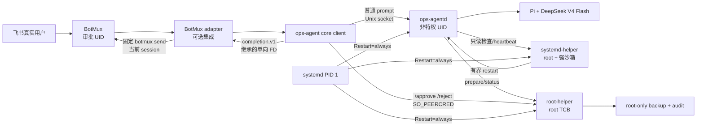

# 架构与进程边界

## 控制流

普通消息永远先进 agentd。`/approve`、`/rollback`、`/reject`、`/status` 在 client 本地解析，不会进入模型上下文。root-helper 对每条请求读取内核提供的 `SO_PEERCRED`：agent UID 只能 `prepare/status`，审批 UID 才能 `approve/rollback/reject/status`。

assistant 正文只从 agentd 流回 core client。core 只向启动者预先继承的 FD 写 `completion.v1` NDJSON，不识别任何消息桥、会话环境变量或发送命令。可选 BotMux adapter 校验环境中的 session ID 与启动参数完全一致后，才用固定参数和 0600 临时文件调用 `botmux send`；启动 core 前会剥离 BotMux、飞书和 Lark 环境变量。Bridge credential 永远不进入 core 或 agentd。

事件 FD 是窄接口，不是 callback shell：core 不接受可由消息内容或环境变量指定的可执行命令。新的 IM 集成应在 `integrations/<bridge>/` 中包装 core、继承事件 FD 并自行实现鉴权和投递；不得修改 `src/agentd` 或 `src/client` 来接入厂商 SDK。

## 三进程为什么不能合并

- agentd 处理不可信 prompt、模型输出和网页/日志数据，攻击面最大，必须永久非特权。
- root-helper 是最小可信计算基，只理解版本化的 tagged-union RPC；拆开后即使 Pi 工具调用被注入，也不能产生协议外 root 行为。
- systemd-helper 的权限只用于主机只读检查和拉起 agentd。它独立于模型会话，agent 卡死或内存泄漏时仍能工作。

## 双 daemon 与故障语义

`ops-agentd` 每 10 秒向 systemd-helper 发 heartbeat。连续超过 45 秒未收到时，helper 可以重启 `ops-agentd.service`；默认在 5 分钟窗口内最多 3 次，每次至少间隔 20 秒。达到上限后停止主动重启并记录审计，systemd 的 `Restart=always` 仍处理进程正常退出或崩溃。

这不是两个任意进程互相 `kill`：systemd 是唯一进程生命周期管理者，helper 只能操作固定 unit `ops-agentd.service`。计划维护时应先停止整个 `ops-agent.target`，避免 watchdog 把 agentd 拉起。

## 文件与 socket

| 路径 | 所有者 | 用途 |
|---|---|---|
| `/run/ops-agent/agentd` | `ops-agent` | agentd client socket |
| `/run/ops-agent/helper` | root:`ops-agent`，目录不可组写 | 两个 root helper socket |
| `/var/lib/ops-agent/workspace` | `ops-agent` | bubblewrap 唯一宿主可写路径 |
| `/var/lib/ops-agent/sessions` | `ops-agent` | Pi JSONL session |
| `/var/lib/ops-agent/root-helper` | root | 变更状态、备份元数据 |
| `/var/log/ops-agent/*` | 各进程独立 | tamper-evident hash-chain 审计，避免 agent 改写 root 审计 |
| `/etc/ops-agent/credentials` | root 0700 | systemd encrypted credentials |

共享 helper 目录使用 setgid 继承 `ops-agent` 组，但组没有目录写权限，因此 agent 与审批账户能连接 `0660` socket，却不能替换 root 创建的 socket。
