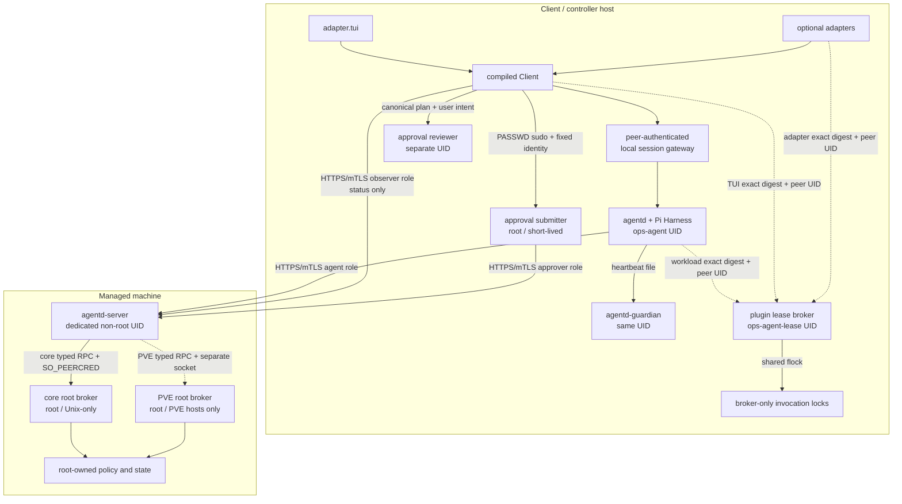

# 架构、进程与数据流

Pi Ops Agent 把“安全地拥有能力”和“具体拥有什么能力”拆开。Core 固定隔离、身份、协议、
审批与恢复边界；Adapter 处理外部交互；Workload 提供 Agent 工具与业务 recipe。插件扩大
授信面，因此源码归属不构成信任，第一方和第三方都走相同摘要与审批流程。

## 组件与真实 artifact

| 规范组件 | 运行身份 | 当前 binary/unit | 职责 | 当前迁移状态 |
|---|---|---|---|---|
| `agentd` | `ops-agent` 非 root | `dist/agentd` / `ops-agentd.service` | Pi Harness、Session、模型、工具编排、sandbox、Agent 审计 | 只走 HTTPS C/S；`/run/ops-agent/helper` 对 unit 不可见 |
| `agentd-guardian` | 与 `agentd` 相同的 `ops-agent` UID | `agentd-guardian` / `agentd-guardian.service` | 校验心跳中的 PID/UID/exe/cgroup/starttime，超时后重新核验并有界终止 | 已替代旧 root watchdog/helper |
| Compiled Client | 交互用户或 Adapter 账号 | `dist/client` / `ops-agent` | TUI 输入、精确命令截获、completion event、审批路由 | TUI 已由 `adapter.tui` registration 门控 |
| Local session gateway | `ops-agent` 非 root | `agentd-client-gateway` / `agentd-client-gateway.service` | 在公开 client socket 读取 `SO_PEERCRED`，绑定 UID、active Adapter ID/digest 与 Session namespace，并维护进程全局单写者租约及 total/per-UID admission | 只代理到 owner-only agentd backend；不解释审批或用户叙事 |
| BotMux Adapter runtime | `ops-agent-botmux` 非 root、无 sudo | 外部 BotMux + digest-approved `adapter.botmux` | 保存 BotMux secret、维护外部会话并连接 agent socket | 只通过 `ops-agent-client` supplementary group 获得 socket/observer/CAS 只读能力；不能审批 |
| approval reviewer | `ops-agent-reviewer` 非 root | `dist/reviewer` / `agentd-approval-reviewer.service` | 只读取用户意图与规范化计划，解释风险并在 batch 时建议拆分 | 当前是确定性 reviewer，不是模型；不能批准或自动改写计划 |
| Source Plugin lease broker | `ops-agent-lease` 非 root | `agentd-pluginctl lease-server` / `agentd-plugin-lease-broker.service` | 以 `SO_PEERCRED` 把 runtime UID 限定到 plugin class，并为 exact current digest 持有 shared registry lock | 仅该账号可读 invocation lock；client runtime 只连接固定 socket，不能开 lock |
| approval submitter | root 短进程 | `agentd-approval-submit` | 固定读取 root-only identity；对 runtime plugin-bound approve 独立解析 canonical ID/digest 并直接持有 registry shared lease；复核 plan、TTY 确认、签短期 grant 并提交 | 无 daemon/socket；由 command-specific PASSWD sudo 启动 |
| `agentd-server` | `ops-agent-server` 非 root | `ops-agent-server` / `ops-agent-server.service` | TLS 1.3 mTLS、角色、Machine/Target、HTTP schema、转发 | 当前 artifact 保留 `ops-` 前缀 |
| `agentd-root-broker` | root | `ops-root-helper` / `ops-root-helper.service` | root-owned policy、typed union、状态、备份、执行、验证、回滚、审计 | 职责已对应；路径仍使用 `root-helper` 名称 |
| JSON config helper | 由 transient unit 切换到目标非 root UID | `agentd-json-config-helper`（固定安装到 `/usr/lib/ops-agent/`） | strict JSON/openat2 inspect、snapshot、semantic scalar mutate 与 digest CAS | 无 socket、无策略、不能自行选账号/path/field；只由 core broker 以 root policy 构造 argv |
| PVE root broker | root，仅 PVE host | `ops-root-helper --domain=pve` / `ops-pve-root-helper.service` | 只处理 PVE tagged union、独立 socket/state/audit、固定 `/usr/bin/pvesh` 调用 | `init` 检查本机入口；`join` 还要求 signed `--pve` enrollment 精确匹配 |
| Source Plugin registry | 注册时 root；读取时非 root | `agentd-pluginctl`、`internal/pluginregistry` | 源码检查、摘要、不可变快照、scope grant、`current` | 每次安装/更新逐次本地审批；已用于必需的 TUI/base 与可选 PVE、Hermes/BotMux profile |

规范文档使用 `agentd-root-broker`，排障命令必须使用当前真实 artifact 名称。不能在 unit、
socket 和迁移脚本尚未完成前机械改名。

## 信任拓扑



同一 LAN、同一 Unix group 和“第一方代码”都不是信任边界。重要分隔如下：

- `agentd` 可以访问模型网络，但没有 root、approver 私钥或 Adapter secret；
- Source Workload host 与 `ops_bash` 都在无网络 bubblewrap 中运行，只写当前 Session workspace；
  真实 bubblewrap/user namespace 不可用时初始化 fail closed，不存在宿主 shell fallback；
- reviewer 使用独立 UID、PrivateNetwork 和 AF_UNIX，只能看到有界用户意图和 canonical plan；
  普通 `file.write` 的完整有界正文、digest 与 bytes 都在 plan 中，secret-like 正文会被提升为
  critical；
- `agentd-server` 有网络但没有 root；broker 有 root 但没有网络监听；
- `ops-agent-server` 与 `ops-agent` 没有共享 supplementary group；core/PVE broker socket 只以
  `ops-agent-server` 的 `0660` group mode 授权，且 `/run/ops-agent/helper` 对 agentd unit 不可见；
  mTLS 文件也按 server/agent identity 分组；
- core 与 PVE broker 在正常执行路径的 systemd mount namespace 中互相隐藏对方的 socket、state、
  audit 与 receipt private key；两者也不应读取 approver/agent/observer/server private key，PVE
  broker 不读取 Source registry。该分隔用于最小化正常可见面和意外访问，不是已被攻陷 root
  broker 的 containment boundary；full-root 进程可以逃逸 namespace 或委托 PID 1；
- `ops-agent-client` 与 `ops-agent` service group 分离：本地管理员和获准 Adapter 仅用前者
  连接公开 `agentd.sock`。`agentd-client-gateway` 不信任 group membership 或调用方提交的
  `sessionId`：它从 Unix `SO_PEERCRED` 取得真实 UID，将其与 exact active Adapter ID/digest 和
  外部 Session ID 一起派生 backend namespace，并在整个 gateway 进程内只允许一个 live writer；
  agentd 只监听同 UID owner-only 的 `backend.sock 0600`。client principal 还可只读 Source Plugin
  CAS，并使用 observer mTLS 查询 status；agent private
  key 是 `ops-agent:ops-agent 0600`，client group 无法读取；
- `ops-agent-lease` 静态账号没有 supplementary group；仅 lease broker unit 运行时附加
  `ops-agent-client` 以读取 registration。它通过固定 group socket 接收请求但以 `SO_PEERCRED`
  将 agentd、本地管理员、BotMux 和派生 Adapter UID 限定到各自 plugin class；只有它能 traverse
  `root:ops-agent-lease 0750` invocation lock 目录，client principal 不能直接持锁或伪造审批；
- Client、Agent 与 Adapter 都不能读取 approver mTLS/ApprovalGrant 私钥或访问 broker socket；
  私钥是 root-only，只有每次交互式启动的 approval submitter 能读取；
- submitter 是例外的短生命周期 root HTTPS client，但其调用者不能传 URL/credential path；它只
  使用 root-owned registry 中 pin 的 HTTPS origin、TLS 1.3 identity，且禁止 redirect；
- reviewer socket 即使被本地管理员 UID 访问也没有授权价值：reviewer 无私钥、无 broker
  socket，且 `canAuthorize=false`；
- BotMux 不复用本地管理员账号；`ops-agent-botmux` 的 primary group 独立，唯一 supplementary
  group 是 `ops-agent-client`，因此只能连接 client socket、读 CAS/observer identity，不能使用
  agent service/reviewer/server/broker group 或 sudo；
- `agentd-guardian` 与 `agentd` 同 UID，只改善可用性，不能防御被控制的同 UID 进程。

## Core、Adapter 与 Workload

### Core

Core 固定以下机制，但不注册任何 Agent 可见的业务工具：

1. Pi built-in tools、skills、extensions 和 prompt templates 默认关闭；
2. Session workspace、bubblewrap、非 root service account 和 systemd hardening；
3. Machine/Target pin、HTTPS/mTLS role、strict JSON、deadline 与有界响应；
4. root broker 的版本化 operation tagged union、root-owned policy 和恢复状态；
5. 模型外审批命令、plan/grant 摘要、reviewer、nonce 与审计。

Core 不包含 Hermes、BotMux 等业务工具、unit/path profile 或标准 plugin ID。PVE 的跨语言
operation arms 保留在共享协议与 broker，作为稳定、可验证的 typed ABI；它们接受 root policy
精确 pin 的任意合法 `workload.*` caller，而不把仓库随附的 `workload.pve` 当成 authority。
Agent 只有从获批 source descriptor 得到模型工具，Workload runtime 也只能调用固定 PVE provider，
不能传 raw PVE argv。

无法预先类型化的 full-root 管理只能走独立的 `breakglass.script` manual root capsule。任意 root
Target 都可 prepare；它不依赖额外 capability switch 或 Target pregrant，也永远不能进入
`authorization.standingScopes`。Agent 只能准备计划，完整 script、digest/bytes 与 network
声明进入 reviewer 和本地 TUI 的 PASSWD/TTY 审批；reviewer 对每个 capsule 都给出 critical
finding。`network=false` 只要求 transient unit 使用 best-effort `PrivateNetwork`，full-root script
仍可逃逸或委托 PID 1，不能当作不可逃逸的断网边界。backup paths 与 verify script 可以留空；
verify script 是调用者提供、以相同 root 权限运行的 privileged postcondition，不是独立 verifier，
缺少相应证据时继续标为 critical。该例外只存在于 core broker；PVE broker 不接受 raw script。
备份只是恢复证据，capsule 不提供自动 rollback。

### Adapter

Adapter 负责：

- 稳定外部 conversation/thread 与 Agent Session 的映射；
- 入站身份、消息类型、去重与 bounded envelope；
- 出站 completion、quote/reply/mark 等平台动作；
- 在能独立证明真实用户、私聊语义和 replay 状态时产生审批意图；否则回落到 TUI。

`adapter.tui` 是本地恢复入口。root-owned `/usr/local/bin/ops-agent` launcher 每次用
固定 Adapter runner 通过 `agentd-pluginctl current --runtime` 前后两次重验 active digest，
解析 snapshot 中唯一的不可执行 `profile.json`，核对精确 TUI capability/scope 后直接启动固定
compiled Client；runner 同时通过 peer-authenticated `agentd-plugin-lease-broker` 固定 socket 为该
exact digest 持有 shared invocation lease，直到 Client
退出，因此更新必须等旧 TUI/Adapter runtime 结束后才能取得 exclusive lease。compiled Client
还会独立取得同一 TUI digest lease，外层 runner 意外退出也不会撤销其审批边界；它在宿主 TTY
直接运行，才能使用 host sudo/PAM。Client 连接公开 socket 时还必须提交 runner 固定的 Adapter
ID/digest；local session gateway 用真实 peer UID 重验 current registration，并把可预测的外部
Session ID 变换到 UID+Adapter+digest namespace。相同字符串不能让 BotMux 或其他 Adapter 进入
TUI session，digest 更新也不会继承旧 namespace。可执行 Source Adapter 则经保留网络、宿主用户权限和
controlling TTY 的双层固定 bubblewrap PID namespace 启动。outer bwrap 保留自己的默认 PID 1
reaper，且只启动同一个固定 root-owned inner bwrap；inner 才使用 `--as-pid-1 --disable-userns`，
让 Source 入口成为 inner PID 1 并关闭后续 userns。outer 以专用 `--sync-fd` 将只有其 PID 1
持续持有的生命周期管道交给 runner，并通过有界 `--info-fd` 报告这个 init 的宿主 `child-pid`；
runner 立即绑定该 PID 的 start identity。bubblewrap monitor 即使先返回 initial process 状态，
Node 的 `close` 也必须等待 sync FD EOF，随后还要等 exact init identity 从 `/proc` 消失（或明确
发生 PID reuse）。只有这两项都成立才确认 outer namespace（包括 detached/unref 后代）清空并
释放 lease；sync error 不得让 identity wait 短路，初次 stat 不可读时只接受 PID 后续 ENOENT，
info 无 authoritative PID 时保持 fail-stop。outer 本身不能使用 `--as-pid-1` 或
提前 `--disable-userns`。两层都只创建 `user/pid/mnt`，不创建 network namespace；bwrap 的
`--dev /dev` 自行构造最小 synthetic device view，禁止改成导入宿主 `/dev`。这个 lifecycle
containment 不是无网络或文件系统 sandbox 声明。runner 不会执行 TUI
snapshot 源码。唯有这个固定 profile 可请求
`approval.submit.local`，且仍要求本地 TTY、reviewer 与 PASSWD submitter。BotMux 采用 immutable
Source 原则，但只以专用 `ops-agent-botmux` UID 执行 `.mjs`。固定 runner 也可运行其他
获批 `.mjs` Adapter，不过必须满足 strict `agentd.adapter/v1` descriptor，且所有非 TUI ID 都
强制 status-only；它从不在 agentd 进程内 import/eval 源码。descriptor 通过
`agentd.adapter-inbound/v1`、`agentd.adapter-session-control/v1` 与
`agentd.adapter-outbound-action/v1` 精确声明类型/control/action 子集，runner 将每项确定性映射到
动作级 manifest capability 和带 Adapter namespace 的 requested scope，完整数组不相等即拒绝。
Source 与 compiled Client 是 sibling：FD 4 只承载 strict typed inbound/session NDJSON，FD 3
反向承载 completion，runner-only FD 5 固定 Client 所见 descriptor/digest；BotMux 初始与后续
消息只能走 bounded bracketed-paste stdin，positional argv/`@file` 不构成输入通道。
descriptor 还必须声明固定 `runtimeAuthority`：compiled Client 或 source process、
`host-as-runtime-uid` 文件可见面、host network、runtime UID 可读 credential，以及
`digest-review-and-typed-ipc-contract` enforcement。后者只绑定源码摘要审核和 typed IPC，
**不是**源码进程的 OS action sandbox；持有平台 credential 的 Source Adapter 仍可在其非 root
专用 UID 权限内直接调用平台。为让批准覆盖真实授信面，adapter `plugin.register` 的 canonical
plan/reviewer 必须展示 runtime UID、文件/credential/network authority 与这一 direct-call 限制。
TUI 当前只声明 `text + bind + display`，BotMux 只声明 `text + bind + send`；其余 union variant
只是 capability-ready ABI，尚无通用 transport consumer，不代表已有 handoff、compact/clear、
reply/quote/mark、持久 outbox 或远端审批。

TUI 更新有一个窄的防自锁交接：仅当 canonical plan 恰好只有一个声明式
`adapter.tui plugin.register` step，且用户在同一本地 TUI 完成第二次确认后，Client 才先停止输入、
关闭 agent session、显式释放自己的 exact-digest lease，再经固定 FD 6/7 的
`agentd.adapter-runner-control/v1` 请求外层 runner 释放同一 digest lease。runner 必须先收到 broker
的 release acknowledgement 才回 ACK，随后旧 Client 无论提交成功或失败都退出。root submitter
只在这两份 lease 都释放后启动；任意另一个 TUI/runtime 仍持有 shared lease 时，registry exclusive
更新照常 fail closed。Source Adapter 不能使用这个控制面。

详细契约见[Adapter 文档](adapters.md)。

### Workload

Workload 有两类能力：

- 非特权能力：sandbox 命令、Machine/Target 发现、只读诊断；
- 特权 recipe：以严格参数调用 broker 的已知 operation，绑定 policy、plugin digest、备份、
  验证和回滚语义。

每个已注册 Workload 的 `workload.mjs` 都由一次性、无网络 bubblewrap host 在只读 CAS 上执行；
它声明工具 schema、业务校验规则、provider composition 并格式化结果，但不在 agentd 进程内
import。业务 tool capability 必须与获批 manifest 精确相等；provider name 则是独立 ABI，Core
按 name 查找固定 provider policy，并只在 registration `requestedScopes` 覆盖该 policy 的全部
required scopes 时允许调用。Capability 名称与 provider 同名本身不产生授权。
describe 前后复查 current digest；invoke 则必须以真实 runtime UID 连接固定 lease broker socket，
为 Session 中的 exact digest 取得跨进程 shared invocation lease，并保持到所有 provider 请求、
签名 status 处理与本地审计结束；runtime 永不直接读取 broker-only lock directory。Registry 的
register/activate/deactivate 使用同一 plugin lock 的 non-blocking exclusive 端，因此 `current`
从 A 切到 B 不可能穿过一个仍以 A 调用 provider 的 Workload invocation。固定 host 使用双层
bubblewrap：outer 的默认 PID 1 reaper 收拢 outer namespace，inner 才让 Source 入口成为 PID 1
并禁止继续嵌套 userns；outer 在此之前只启动固定 root-owned inner bwrap。outer 还用专用
`--sync-fd` 与有界 `--info-fd` 提供 PID 1 completion evidence；runner 不把 monitor 的
initial-process exit 或单独的 FD EOF 当完成，必须继续等 exact init process identity 消失。即使
源码利用 runtime 缺陷产生 detached 后代，runner 也不会在 outer reaper
收完进程树前执行 managed release。当前 socket-backed registry lock 不持久跨 broker crash、强制
断连或 runtime SIGKILL；该异常窗口在引入 supervisor/pidfd 或持久 quarantine 前属于明确限制。
两层都只请求 `user/ipc/pid/net/mnt`；agentd unit 的 `RestrictNamespaces=` 只放行同一集合，继续
拒绝 cgroup/UTS/time namespace。`ProtectHostname=yes` 保留 service 级 UTS 隔离；对
`/proc/sys/user/max_user_namespaces` 的窄 `ReadWritePaths=` 例外只让两层固定 bwrap 建立 inner
user namespace；inner 的 `--disable-userns` 在进入最终 namespace 前设置 namespaced quota，
并以再次 `unshare(CLONE_NEWUSER)` 必须失败作为 postcondition。最终 procfs 显示的数值不是这条
deny 的证明，非 root agentd 仍无权修改宿主 sysctl。为让该路径存在，agentd unit 固定使用
`ProtectProc=invisible` 与 `ProcSubset=all`，不能退回会隐藏非 PID procfs 的 `ProcSubset=pid`。
这里的 `invisible` 只隐藏其他 UID 的 PID 目录：same-UID 进程目录以及未被其他 hardening 屏蔽的
非 PID procfs 全局元数据仍可见；后者除上述精确 sysctl 例外外保持只读。这不是 procfs
confidentiality boundary，`PrivateDevices=yes` 与 `ProtectKernelTunables=yes` 仍必须保留。

outer 与 inner 的 procfs 必须分别匹配各自 PID namespace。outer 创建独立 PID namespace、保留默认
PID 1 reaper 与 sync/info/exact-identity completion barrier，并用 `--proc /proc` 建立 outer 视图；
fixed inner 再创建自己的 PID namespace 与私有 procfs，最终 Source PID 1 只看见 inner 视图。不能让
outer 继承 service proc 视图：GitHub-hosted run `31319405888`（commit
`7091ecfbc28ae6410f06d4e2b64462c96dd83726`，job `93259846767`）验证该候选会让 inner 返回
`bwrap: open /proc/3/ns/ns failed: No such file or directory`。因此 outer proc mount 不是可省略的
兼容细节，也不能以单层 bwrap、移除 PID namespace 或缩短 lease settlement 代替。

Ubuntu 24.04 Noble 在 restricted-userns=`1` 且 AppArmor enabled 时，本 Release 的 controller
架构明确 unsupported。带 `ProtectProc=invisible` 的 exact `NoNewPrivileges=yes` static boundary
已经证明正确的 outer `--proc /proc` 会返回 `EPERM`，而省略 outer proc 又破坏 inner namespace
解析；两条 hosted 证据共同排除了当前 AppArmor setup-profile 方案。controller `init` 必须在账号、
unit、plugin、sudoers、host policy 或任何其他持久 mutation 前拒绝，不得把 direct smoke、
`host-policy install` 或旧 managed state 当作 support signal。

不能通过关闭 restricted-userns sysctl、启用 SUID bwrap、删除任一 bwrap 层、降低
`ProtectProc`/systemd hardening、使用 unconfined profile 或扩大 host-wide exec authority 来制造
成功。真正支持这类 host 需要独立、typed、短生命周期 spawn supervisor，把 setup authority 与
固定 launch request 绑定；当前长期 Node Core 不能承担该角色。

早期候选可能已留下 exact managed AppArmor files 或 loaded kernel profiles。它们包含诊断/恢复
证据，默认卸载保留，helper `remove` 继续 fail closed；`inspect/install` 立即返回 unsupported，
`status` 只做 strict exact legacy inventory：永不返回 `0`，`3` 仅表示 safely absent，`1` 表示
managed、drift 或 inaccessible，且后两类可在状态正文前失败；它不会把 host 升级为 supported。
任何移除必须走另行设计、
能处理 active-label 竞态的主机维护流程。BotMux setup 继续按实际 restriction/AppArmor evidence
在 mutation 前拒绝。无法管理宿主 policy 的 LXC/OrbStack 同样没有降级路径。

`join` endpoint 不安装 agentd、Adapter 或 Workload Source runtime，只部署 server/core broker，且
按 signed enrollment 与本机 `/usr/bin/pvesh` 条件部署 PVE broker；因此它不受 controller 的 Noble
限制，也永远不得安装、更新或删除上述 host policy。

`workload.base`、PVE、
Hermes/BotMux 运维都走这条 Source host 路径；旧 `.opspkg` catalog 和 OCI
`managed-workload` executor 仅为 Hermes 兼容恢复保留。两条插件路径的迁移关系见
[Plugin 文档](plugins.md)。

`adapter.tui` 与 `workload.base` 是 controller 启动所需的两个源码插件。若安装器无法证明真实
bubblewrap/user namespace 可用，它必须在启动 agentd 前失败并回滚；不能只隐藏 `ops_bash` 后让
`workload.base` 用宿主 Node、shell、Docker 或进程内 import 运行。

`workload.hermes-ops` 与 `workload.botmux-ops` 的源码自行定义 service/config/diagnostic tool schema、
unit/path 正则和 provider composition。既有只读 metadata 调用通用 `target.inspect`；固定 CLI
诊断调用 `workload.command.inspect`，Source 只能选择 semantic `profileKey`，Core 根据实际 caller
注入 ID/digest。root-owned Target policy 才保存 non-root account/home、完整 executable/argv、
timeout/output bound；broker 解析 symlink 后要求 executable 原路径与 resolved path tree 全部
root-owned 且 group/world 不可写，再经独立的 `systemd-run --wait --pipe --collect --uid=...`
transient service 执行。该 unit 固定 `ProtectSystem=strict`、`ProtectHome=read-only`、
`PrivateNetwork=yes`、clean environment 与 cgroup timeout；core broker 自己继续保持
`ProtectHome=yes`。命令结果由 core broker receipt 绑定 server/machine/Target/plugin/digest/
profile/result digest；两层 audit 只保存 output digest/bytes/truncated 等元数据，标准 Source 再做
业务输出白名单。

变更部分调用通用顺序 provider `workload.service.manage`。该 provider 不知道标准业务 ID 或 unit
profile，拒绝 `workload.base`，重验实际 source caller 后注入其 ID/digest，再只把账号、
`system|user` manager、source 已校验 unit 和 `reload|reset-failed|restart|start|stop` 送入
`workload.service.action`。Target policy 仍精确绑定同一 plugin ID/digest/account/manager/unit/action，
broker 只构造固定 `systemctl` 或 `runuser ... systemctl --user` argv，并在执行前后读取权威状态。
`reload` 与 `reset-failed` 永远逐次审批；任意命令、argv、env、用户可写 CLI 和配置正文仍不受该 ABI
支持。BotMux 的单字段配置写另走 `workload.json-config.edit`：Source 只给 semantic
profile/selector/field 与 tagged scalar，Core 注入 caller digest，Target policy 决定账号、路径和实际
JSON key。Broker 在 hardened target-UID transient unit 中调用固定 helper，绑定 before/after、整文档
rewrite、root-sealed evidence 与 digest CAS；它永不 standing，且本地审批从 review 到 submit 持有
exact digest lease。新增 root recipe 必须先提供绑定实际 caller digest 的 broker arm 与更窄 provider。

## Machine、Target、Session 与 Workspace

```text
Machine 1:N Target
Machine 1:N AgentSession
AgentSession 1:1 SessionWorkspace
Change 1:1 Server + Machine + Target
External conversation -> Adapter mapping -> AgentSession
```

- `serverId` 与 `machineId` 是固定身份；IP、DNS 和端口只是 locator；
- 每台受管机器运行一个非 root server 和一个本机 root broker；
- Target 是 root-owned policy 中的一组账号、路径、unit、PVE guest 或其他资源；
- Target 的资源 allowlist 只决定 operation 是否可 prepare。只有显式
  `authorization.standingScopes` 中的精确普通 scope 才表示已有持久授权；缺失字段、legacy
  policy 或空数组都保持逐次人工审批。当前 standing 只覆盖精确的 `file.write`、
  `service.action`、`workload.service.action`（不含 `reload`/`reset-failed`）和各 PVE operation scope；package/artifact 安装、
  package/artifact 安装、`plugin.register`、`plugin.install`、`workload.deploy`、`breakglass.script` 与 rollback 永不 standing；
- 通用 `file.write`/`service.action` 的 Source 输入不能自报 provenance；Core 只接受实际
  `workload.base` caller，由 trusted provider 注入当前 plugin ID/digest。对应 standing scope 还要求
  Target 的 `authorization.baseWorkloadDigest` 精确相等；更新源码或换 caller 会安全回落到逐次审批；
- `file.write` 的 root-owned policy 根本身可以是单独 filesystem 或 bind mount 的挂载点；broker
  以拒绝 symlink/magic-link 的 `openat2` 取得该精确根的 fd 后，才从这个 fd 开始对所有后代强制
  `NO_XDEV`，并继续绑定 parent/target 的 device + inode。根以下的嵌套挂载仍然拒绝；
- 对 Source Workload，实际能力始终是 active plugin ID/kind/digest、descriptor 与 manifest 的
  exact capability 一致性、provider-name policy 的 requested-scope grant、server capability、Target
  资源 allowlist 与 standing scope 的交集；任一项变化都 fail closed。Session 只特判必需的
  `workload.base`，不会按 Hermes/BotMux/PVE 标准 ID 选择 compiled profile；
- Session 第一次成功使用 Target 工具时原子绑定 Machine + Target，之后不能换目标；
- 每个 Session 有自己的 workspace，bubblewrap 只将其绑定到 `/workspace`；
- policy/capability revision 会写入受信 workspace context，并在工具调用和审批时再次绑定。

当前 gateway 已在同一进程内为每个 canonical namespace 维护 process-global live-writer lease，
因此多个 Client connection 不能同时写入同一 namespace。该 lease 不跨 gateway restart、多个 gateway
实例或 Adapter handoff 持久化；这些场景会断开现有 writer，跨平台 handoff 仍是待实现能力。
systemd 让 gateway `PartOf=ops-agent.target`，但对 agentd 只使用 `Wants=` + `After=`：启动 gateway
会同时拉起并等待 agentd，停止整个 target 仍会停止两者；guardian 终止卡死 agentd 并由 systemd
自动重启时，gateway 本身不会被 stop-propagating dependency 一并停掉。旧 backend fd 的 EOF 会让
对应 Client 断开并释放 writer/admission 状态，backend socket 恢复后同一外部 Session 可由 fresh
Client 重新连接。gateway 启动不以 backend pathname 已出现为前提，避免与 `Type=simple` agentd
建 socket 的短暂竞态；每个真实 backend dial 都重新验证 pathname 为本 UID owner-only `0600`
socket，并比较 dial 前后的 device/inode identity，变化则关闭新 fd 并拒绝。这里不能使用
`BindsTo=ops-agentd.service`：依赖触发的 clean gateway stop 不会被 gateway 的 `Restart=always` 在
agentd 自动恢复后反向拉起。

## 一次模型 turn

Pi `0.84.1` 的 `agent_settled` 是 authoritative completion：重试、compaction 和 queued
continuation 全部结束后才能发送一次 `done`。`prompt()` 正常 resolve 只作为兼容 fallback；
一次 turn 的 completion 由 Client 按 `turnId` 去重。

Client 与 agentd socket 断开时会：

1. 停止并解绑本地 TTY 或 Source FD 4 typed input；
2. 等待在途 direct command 与 completion event 排空；
3. 退出进程，让 BotMux/tmux 重新创建已经失效的 PTY。

这避免“CLI 进程仍活着但永远连不上 agentd”的历史故障。digest-validating runner 以
`shell: false` 启动 Source 与 compiled Client sibling：FD 4 是 Source→Client 的
`agentd.adapter-inbound/v1`/`agentd.adapter-session-control/v1` strict NDJSON，FD 3 是
Client→Source 的 completion；仅 Client 继承 FD 5 上 runner 已捕获并绑定 active digest 的
descriptor context，Source 不能替换正式 Client 所见 descriptor。不能把 callback 命令交给 shell。

## C/S 协议

`agentd` 和 root approval submitter 通过 HTTPS + JSON + mTLS 访问 server：

- TLS 最低版本 1.3，客户端证书必须且只能带一个 `agent`、`approver` 或 `admin` role URI；
- Agent role 可读、prepare 和 status，不能 approve/reject/rollback；
- Approver role 可 status 与提交签名 action，不可运行普通 inspect/prepare；
- Admin role 是模型外恢复/管理 identity，可访问两组 endpoint，但 change action 仍必须携带有效
  ApprovalGrant；标准 TUI 不生成或持有 admin 私钥；
- Server 严格拒绝未知 JSON 字段，限制 header/body/response、deadline 和请求超时；协议校验与
  backend/handler dispatch 必须使用同一 server clock 计算剩余时长，再转成有界 monotonic timeout，
  已过期或时钟回退导致窗口超过十分钟时均在进入 broker 前 fail closed；
- Server 将已认证 role 与固定 server identity 写入 Unix RPC，broker 通过 `SO_PEERCRED` 再校验
  本机 server UID；
- broker 是 mutation 与终态的权威，网络断线后只能查询原 change，不能重发 mutation。
- server 仅 relay broker response。core/PVE broker 分别签署 domain-bound Ed25519 receipt；Client
  与 submitter 从该 server registration 读取固定公钥，校验 request/method、server/machine/
  target、change/plan、state/audit 和完整结果摘要，非 root server 因而不能伪造终态。
- `change.prepare` response 本身不作为终态证据。每次 prepare 后 controller 必须使用新的
  requestId 查询 `change.status` 并验证对应 domain 的 pinned broker receipt，随后才可报告
  `PENDING_APPROVAL` 或 standing execution 的 `COMMITTED`/失败终态。

当前实现有 requestId 结果缓存与 approval nonce 消费，但没有完整的分布式 rate limiter、
多 server HA 或在线 enrollment nonce 消费表；部署者不能把这些能力写进威胁假设。

## 审批数据流

1. Agent 只能通过 `change.prepare` 提交 tagged operation；trusted provider 从 broker response
   取得不透明 change reference，不采信 Source Workload 自己输出的 `details`；
2. controller 立即使用新的 requestId 调用 `change.status`，并按 server registration 校验该
   domain pinned Ed25519 broker receipt。无签名、错误 domain/key、scope/result digest 不匹配都
   fail closed；
3. 若签名 status 已是 `COMMITTED`，说明 operation 同时命中显式 standing scope、plugin grant 与
   Target 资源 policy，controller 可报告 standing execution 成功，但不暴露审批 side-channel；
   其他 terminal 状态也只按签名 status 报告。只有签名 status 为 `PENDING_APPROVAL` 时，Client
   才把 change reference 暴露给审批 side-channel，并把 trusted-provider prepare correlation 与
   当前 Session/turn 的真实用户输入绑定；
4. Client 在发送原始用户输入时已按 Session/turn 保存有界、脱敏的 intent；对上述 pending change
   只能把该 turn 的 intent 不可变绑定到对应 `changeRef`。用户输入精确
   `/approve <changeRef>` 或 `/rollback <changeRef>` 时，Client 在进入模型前截获并按引用取回绑定；
5. Client 再用 pinned registration 的 observer identity 查询带有效 receipt 的权威 status 和
   规范化 `ApprovalPlan`；Client 本身没有 approver identity 或签名 key。唯一无 live plan 的
   例外是 operation 可严格解析、且 `planHash` 精确匹配 v0.1/v0.2
   `scope NUL-prefix + stored operation bytes` 算法的旧 change：broker 明确签署
   `recoveryOnly=true`，该状态只能 reject 或在 `rollbackAvailable=true` 时 rollback，永远不能
   approve/execute。无法重建 current plan、但也不匹配该旧算法的任意 hash mismatch 直接拒绝，
   不能借 recovery-only 获得 authority；
6. reviewer 只收到该 change 在 prepare turn 绑定的用户意图与 plan，不读取 controller 全局的
   “最近输入”。多 pending change 各自保留原绑定；后续无关输入不能覆盖它。Client 重启、Session
   resume、wrong-turn/冲突 correlation 或超限 intent 造成绑定不可用时，approve/rollback fail
   closed，要求从简短真实请求重新 prepare；不会伪造 fallback intent。普通 `file.write` 的完整
   有界 `contentText` 连同 digest/bytes 进入 plan；缺少正文或正文疑似 secret 时 reviewer 提升到
   critical。break-glass 的有界 script text/digest、可选 verify text/digest、backup paths 与
   network 声明明确进入 plan，供 reviewer 检查实际命令和缺失证据。
   reviewer 不读取 Agent 的解释、transcript、密钥、policy 文件或 broker socket；
7. 第一次命令返回 `REVIEW_REQUIRED`，展示 deterministic risk floor、findings 和解释；
   若 reviewer 要求拆分，Client 返回带同一 review/findings 的 `SPLIT_REQUIRED`，明确不提交、
   不缓存为审批确认，并解除输出冻结让用户准备新的独立 canonical changes；
8. 两分钟内第二次相同命令、相同 plan/review digest 才允许 Client 用固定 argv 调用
   `sudo agentd-approval-submit`。对 plugin-bound approve，Client 必须从 plan 的所有 step 提取唯一
   canonical plugin ID/digest；缺失、混合或与 plan 顶层 digest 不同都 fail closed。若 A 已不再
   current，旧 A pending plan 不能批准；Client 取得的 exact A shared lease 是前置纵深防御，不能
   代替 root submitter 自己的锁。sudoers 使用 `PASSWD` 和
   command-specific `timestamp_timeout=0`；
   Client 只在 agentd ready 且 idle 时开始或继续审批。从首次 reviewer 调用、`REVIEW_REQUIRED`
   展示和等待第二次相同命令，直到 submitter/sudo/TTY 完成，Agent 输出都不能写入审批终端；它
   只能进入 256 KiB 有界缓冲，ANSI、C0/C1 与 bidi 控制符先转义，审批结束后再以
   `delayed untrusted agent output` 分隔区显示。缓冲超限只截断，不能挤占或伪造审批证据；
9. submitter 必须是 euid 0，从固定 root-owned registry/credential 读取 identity，使用 TLS 1.3
   在人工确认前后各查询一次带有效 broker receipt 的权威 status。第一次 status 验证后，若
   `approve` 的所有 runtime step 属于 `service.action`、`file.write`、`workload.service.action`、
   `workload.json-config.edit` 或 PVE operation，submitter 必须从 canonical plan 提取唯一 workload
   plugin ID/digest，拒绝混合、缺失或冲突 provenance，并直接在固定
   `/var/lib/ops-agent/plugins` 取得 exact-current shared lease；该 root-held lease 覆盖 independent
   reviewer、`/dev/tty`、第二次 status 和最终 broker action，Client 或 lease broker 连接丢失不能
   提前释放它。注册/安装/部署候选摘要与 rollback 不要求 runtime current。随后 submitter 把
   ASCII-only canonical plan 写到 `/dev/tty`；
10. 用户必须精确输入
   `APPROVE|REJECT|ROLLBACK SERVER_ID MACHINE_ID TARGET_ID CHANGE_ID PLAN_HASH` 中对应的完整一行；
   之后 submitter 才签两分钟 TTL 的 Ed25519 ApprovalGrant 并 POST action；
11. server 校验证书 role，broker 校验 grant、plan、policy/capability revision、期限和 nonce，
   然后进入执行/验证/恢复状态机；submitter 仍须验证 action response 的 receipt。

reviewer 的结论是 advisory：`canAuthorize` 永远为 false，不能降低确定性最低风险。当前只有
有界、quote/nesting-aware 的确定性词法/结构分析，不是完整 Shell AST 或语义 verifier；不透明
wrapper/argv/展开只会提升为 critical。当前没有 LLM/AST reviewer，也没有由 reviewer 判断风险后
自动批准；standing execution 是 root-owned
policy 对精确 operation scope 的既有授权，不读取 reviewer 结论。这些能力若扩展，仍不能把签名
能力交给 reviewer。审批
安全同时依赖本机 root、sudo/PAM 和真实 TTY 完整性，不能把 submitter 变成免密或无交互服务。
`reject` 不运行 reviewer，可以使用本地精确 `/reject` 命令本身作为明确拒绝意图；它不能借此
为 approve/rollback 恢复或合成丢失的 prepare intent。

旧 v0.1/v0.2 change 可能在升级时只剩旧 planHash 与恢复证据，无法按新 provenance 字段重建
canonical plan。Broker 只有重算精确旧 hash 成功后才签 `recoveryOnly`，并同时签署严格
`recoveryDescriptor`：原 operation kind/target/action、精确 compensation target/action、
rollbackData digest、backup object reference/digest、兼容版本与不可用原因。对这种状态 Client
不伪造 plan：pending change
可精确 reject；rollback 第一次显示 critical recovery evidence，第二次相同本地命令才调用
submitter。Submitter 跳过不可能成立的 plan reviewer，但仍在真实 TTY 前后验证同一份 signed
status、显示 ASCII-only 权威恢复元数据并按原 scope/revision/planHash 签 grant。这个窄例外只
恢复或释放旧状态，不允许重新执行旧 mutation。`rollbackAvailable` 是 persisted flag 与当前
兼容矩阵/证据检查的交集；当前自动兼容只包括旧 service compensation，以及能证明写后目标仍为
exact content/uid/gid/mode/dev/ino、且 broker backup 为 exact root-owned regular 0600 digest
对象的旧 `file.write` CAS restore/remove。其他旧 schema 显示原因并保持不可回滚。

## Source Plugin 生命周期

```text
editable source
  -> strict manifest + bounded tree inspection
  -> canonical SHA-256
  -> typed plugin.register plan with ID/kind/version/publisher
     + digest + capabilities + requestedScopes
  -> reviewer + per-install local human approval
  -> broker re-hash + immutable content-addressed snapshot
  -> atomic current pointer
```

更新任何文件都会产生新 digest，旧 grant 不再匹配。Registry 拒绝 symlink、device、socket、
路径逃逸、并发变化和超限树，并在每次读取 `current` 时重新核验 snapshot 与 registration。常规
注册的权威 plan 同时绑定 ID、kind、version、publisher、digest、完整 capabilities 与完整排序
requestedScopes；broker 从 plugin ID 推导 source path，在 prepare 和 execution 时重新扫描并
逐项匹配 manifest，再保存旧 registration 供失败回退。底层 `agentd-pluginctl register` 只用于
启动 bootstrap 和离线恢复。`plugin.register`、legacy `plugin.install` 与 `workload.deploy` 都没有
standing scope；每次安装或更新都必须为当前 digest 重新经过模型外本地审批。

Workload invoke 的精确提交顺序由 registry 的 per-plugin filesystem lease 决定；shared 端只能由
peer-authenticated lease broker 代 runtime UID 取得，client 不可打开 lock：shared lease 先
取得时，该次 A invocation 可以在既有授权下完成，更新会 fail closed、保持 A 为 current，并由
管理员稍后重试；exclusive mutation 先取得时，新的 A invocation 立即失败，B 原子激活后旧
Session 必须重开。已完成的 A invocation 不被追溯撤销；已签名 `PENDING_APPROVAL` 的 A 计划仍
保留审计和 reject/rollback 恢复语义，但 B 成为 current 后 Client 必须拒绝再 approve A，要求在
B 下重新 prepare。即使 current 仍为 A，Client 的第二次确认 lease 也只是前置检查；root submitter
仍须在第一次签名 status 后直接持有独立的 A lease 到最终 action 完成，不能把旧计划解释为 B 或
standing，也不能因 Client/lease-broker 退出而释放。此语义不授权手工替换 `current`；绕过 registry 的 root 修改属于
不受支持的宿主 root 行为。

初始化的唯一特殊行为是：没有 `adapter.tui` 和 `workload.base` 就无法使用系统，因此安装器在
启动前逐项展示两者并要求精确同意；自动化参数只表示外部模型外审批已经完成，不能覆盖其他
plugin。初始化还必须先证明真实 bubblewrap/user namespace 可用于 Source Workload host，否则
整个事务 fail closed 并回滚。

## 部署拓扑

- `init`：controller 上安装 `agentd`、guardian、reviewer、TUI、本机 server、本机 core broker；
- `join`：受管机器只安装 server + core broker，不复制模型、Session、reviewer 或 Adapter；
- managed service 的磁盘 unit 不是最终执行证据：每个 service 都携带 unit-name-specific final
  security drop-in，installer 在 `daemon-reload` 后以 PID 1 的 exact fragment/drop-in path、
  identity/lifecycle/command/environment、typed condition/credential vector 和 security effective
  vector 验证，并拒绝未落入固定 compatibility-reset allowlist 的额外 loaded drop-in。`init` 的集合是
  reviewer、gateway、guardian、lease broker、agentd、server、core broker、healthcheck（按本机
  `/usr/bin/pvesh` 加 PVE）；`join` 只有 server/core（按 signed enrollment + host fact 加 PVE）。
  host-wide `service.d` override 不能让静态文件检查假通过，且 join 不继承 controller drop-in；
- `join` 的 bearer bundle 不提供自身信任锚；endpoint 必须从独立已认证渠道取得 controller CA
  SHA-256 pin，并在验证 bundle 签名之前先匹配 bundle CA；
- fresh `join` 把 controller/endpoint/CA pin/identity/PVE 绑定写入 root-owned
  `endpoint-enrollment.json`。已有 endpoint 的 `join` upgrade 不再接收 bearer bundle，而由新
  release 只读验证该 metadata、当前 policy schema、TLS/DAC 与 receipt keypair 后复用原身份；
  partial/damaged topology fail closed 并触发安装事务回滚；
- `join` 不创建 client group、插件工作树/registry、审批 sudoers、模型配置或 controller health
  timer，也不创建 `ops-agent.target.wants`，并且永不安装、更新或移除 controller Source runtime
  所需的宿主 AppArmor policy；`healthcheck.sh --endpoint` 只检查 endpoint 拓扑；
- PVE：`init` 只按本机固定入口 `/usr/bin/pvesh` 检测是否安装独立
  domain/socket/state/audit 的 PVE broker；`join` 还必须让已签名 enrollment 的 `--pve` 标记与
  该入口双向精确匹配。任一方向不一致都在写 unit 前失败。PVE broker 以固定 API path/argv
  管理 policy 允许的 node、VM、LXC、storage 和 migration target，controller 仍留在管理机。
  endpoint 同时保留 core broker 作为 typed Linux 操作与逐次人工批准的 manual root capsule
  入口；PVE broker 使用独立 domain/key 且绝不接受 raw script。PVE unit 本身只 enable 到
  `multi-user.target`；仅 controller 的 `init` 会显式把它加入 `ops-agent.target`，server-only
  endpoint 不继承 controller target dependency。PVE broker 以 cluster-global
  `pve/vmid/<vmid>` 串行化 mutation；`recoveryOfChangeId` child 只有在 parent 的 durable
  intent/UPID 全部证明 no-start 或 terminal 后，才以单次 state transaction 把 parent 标为
  `SUPERSEDED` 并转移 VMID lock，永不先释放再补偿。仅当 parent 保持
  `STARTED_OR_UNKNOWN`、不存在任何已知 UPID 且普通 reconciliation 无法产生 no-start/terminal
  proof 时，broker-internal unknown-result clearance 可形成第二条转锁路径：server 只向 approver
  certificate role 转发 prepare/confirm，root-owned submitter 仍要求 PASSWD sudo、真实 `/dev/tty`
  及独立 exact confirmation；Agent、reviewer、Adapter 和源码 workload 没有该接口。Challenge
  绑定 exact active-task 空查询、guest/cluster observation 与 parent/child/plan/resource，volatile
  one-shot grant 在最终重新观察后与 parent `SUPERSEDED` resolution、child lock transfer 同一事务
  消费；restart、expiry、reject 或 drift 都使 grant 失效。该 resolution 明示
  `basis=local-unknown-clearance` 并保留 parent `STARTED_OR_UNKNOWN`，不伪装成 no-mutation proof。
  PVE API 启动后先把 node-bound UPID 同时 fsync 到 root-only task artifact 与 change
  evidence，然后 broker 才返回签名 `EXECUTING`。该状态只表示已可恢复接管，不是
  mutation 成功。后续由 broker-owned per-change singleflight worker 使用独立有界 context
  查询原 UPID，进入 terminal 后再做 postcondition verification；它不依赖原 HTTP/CLI
  context，`change.status` 只是签名 observer 与幂等补调度入口。Daemon shutdown 保留
  `EXECUTING/VERIFYING` 与 VMID lock，重启后从 durable journal 续跑；只有原 UPID
  `stopped/OK` 且验证成立才转为 `COMMITTED`。

PVE 操作和当前执行覆盖见[PVE Workload](workloads/pve.md)。

## 当前不应假定的能力

- 没有任意的进程内 Workload loader：获批 Source Workload 只在无网络 bubblewrap host 中运行，
  并只能调用 manifest requested scopes 获批的 provider-name typed policy；descriptor capability
  仍须与 manifest 精确一致但不产生 provider authority；真实 bwrap/userns 不可用时初始化失败；
- 没有跨 gateway restart、多个 gateway 实例或 Adapter handoff 的持久化 Session writer lease；
- Adapter inbound `text` 与 session `bind` 已有固定 FD 4 strict consumer；其他 session control、
  通用 outbound action mediator、持久 outbox 与远端 ApprovalIntent 尚未实现；
- 没有模型 reviewer、命令 AST 拆分或基于 reviewer 风险判断的自动批准；只实现了显式精确
  `authorization.standingScopes` 的持久授权执行；
- 普通 operation 没有任意 root shell；manual root capsule 可为任意 root Target prepare，但永远
  只由本地 TUI/PASSWD/TTY 逐次批准，不可 standing，也不是 Adapter 或 PVE broker 的审批入口；
- 没有 controller HA、多人审批、外部审计锚定或在线 enrollment 单次消费；
- legacy `.opspkg` 与新 Source Plugin 尚处于并存迁移期。
